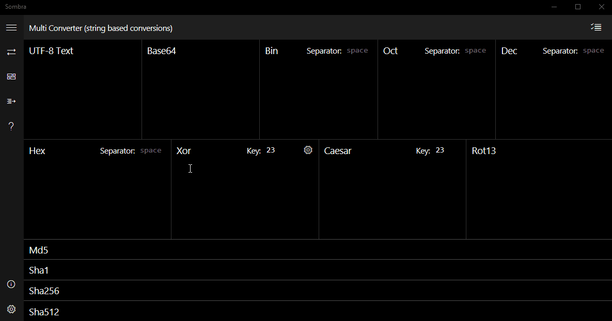
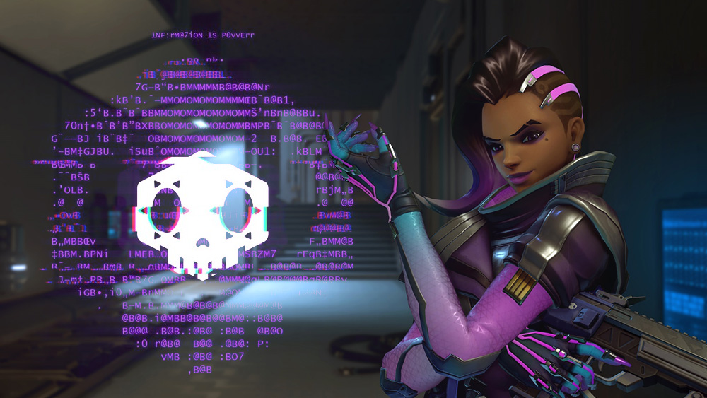

# Sombra
⌨️ Text processing toolkit for conversions, encoding, cipher translation, checksum calculation, hashing, encryption and formatting for developers and ARG enthusiasts.

## 1NF:rM@7iON 1S P0vvErr

In anticipation of Overwatch's new character Sombra an [ARG game](https://wiki.gamedetectives.net/index.php?title=Sombra_ARG) was held by Blizzard. Ciphered clues and puzzles were hidden throughout the game and websites. To help with cracking them Ive put together an app with various convertors, encoders and cipher translators. The ARG is now over but I'd still like to publish the app as it has shown to be useful when developing stuff, educational and simply fun to play with. First step on the road was to release this library of encoders/decoders that power it.

<p align="center">
  
</p>

*Note:* The gif depicts an app that is not released yet. Hopefuly sometime in the future it will. And it is powered by this library.

## Installation

```
npm install sombra
```

## Features

### Convertors and translators

#### Text encoders

Numerical: Binary, Octal, Decimal, Hexadecimal, Base64, Custom radix

``` js
sombra.Bin.encode('boop').toString() // 01100010 01101111 01101111 01110000
sombra.Bin.encode('boop', '.').toString() // 01100010.01101111.01101111.01110000
sombra.Hex.encode('boop', '-').toString() // 62-6f-6f-70
```

Entity escapers: NCR (HTML entities), Unicode

``` js
sombra.NcrDec.encode('<').toString('hex') // &#60;
sombra.Unicode.encode('💀').toString('hex') // U+D83DU+DC80
```

### Ciphers

Ceasar, clock, atbash, A1-Z26, morse code, and many more in the works or with preliminary implementation.

``` js
sombra.Caesar.encode('Avocados are useless.').toString() // Xslzxalp xob rpbibpp.
sombra.Morse.encode('hello').toString() // .... . .-.. .-.. ---
```

#### Checksums

CRC-16, CRC-32, xor, 2's complement, sum

``` js
sombra.Crc32.encode('Avocados are useless.').toString('hex') // 71b3f376
sombra.TwosComplement.encode('Avocados are useless.').toString('hex') // 26
```

#### Hashing algorithms

SHA-1, SHA-256, SHA-384, SHA-512, MD5 (where available)

```js
var promise = sombra.Sha256.encode('Information is power')
promise.then(buffer => buffer.toString('hex'))
// c5a207aeb567728a4650ee49839a1007ac5bc1d9b09f4140de0bca658f2e05a7

```

*Note:* Web Crypto API does not support MD5 in browsers. It is only available in Node and UWP.

### Isomorphic

This library can be used in both Node and browser. Even in UWP.

Data is is handled in `Buffer`s in Node or (in browser) if the `buffer` module [polyfill](https://github.com/feross/buffer) is used. Otherwise Sombra falls back to `Uint8Array` and all methods will accept and return `Uint8Array`.

Similarly `crypto` module is used in Node, Web Crypto API in browsers and `Windows.Security.Cryptography` namespace in UWP Windows apps.

### Streams

All encoders/decoders are not only static methods on the class but the class itself is a `Transform` stream (where available) so you can `.pipe()` data through.

and it also has `.update()`/`.digest()` methods.

```js
myReadStreamFromString('boop')
	// converts 'boop' to 'yllm'
	.pipe(new sombra.Caesar)
	// converts 'yllm' to '-.-- .-.. .-.. --'
	.pipe(new sombra.Morse)
	// hashes '-.-- .-.. .-.. --' to <Buffer eb 5c f0 a3 90 a1 88 98 38 dc ..>
	.pipe(new sombra.Sha256)
	// prints out the buffer as string 'eb5cf0a390a1889838dc1d870ff44aff05d440e9348a8f7308770db56939a551'
	.pipe(myConsoleWriteStream('hex'))
```


## API

Not stabilized yet but the examples from above work just fine.

Work in progress. More sugar incoming.


## Plans for the future

* Finalizing API that's simple and sugar-coated.
* Tidying up the code. Some parts are still a bit messy. Having the converters both streamable and also accessible from static methods makes for a messy code.
* More ciphers - Vigenere, rot13 (and variations), xor, bifid, etc... Some are already in works from before.
* Streamable Decoder classes. Each class currently is a stream of `.encode()`. Despite having `.decode()` method there's not.
* CRC variants (modbus, xmodem, kermit, etc...)


## Note on special characters

Sombra, just like Browser's TextEncoder API or Node's Buffer (by default) works with Utf8 formatted strings. That means special characters will become represented by two or more bytes bytes. For example `§ = <Buffer c2 a7>` and `💀 = <Buffer f0 9f 92 80>`

<p align="center">
  
</p>
